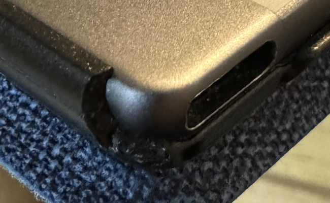
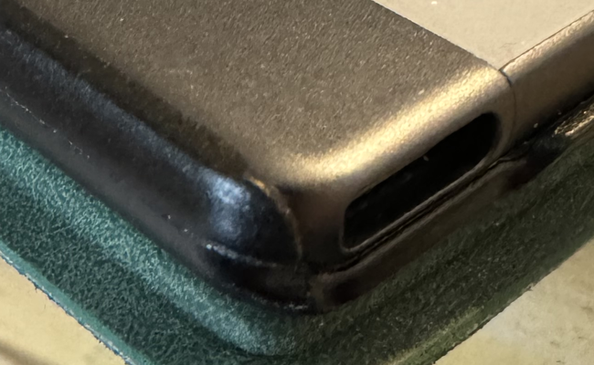

# Cases and Folios

I see a lot of questions about cases and/or folios for the reMarkable tablets.

## reMarkable Folios

The [folios that reMarkable sells](https://remarkable.com/store/remarkable-2/folios) attach to the tablet using magnets. It's a cool idea, however the magnets themselves aren't particularly strong, and it's fairly easy for the tablet to fall out of the folio if you aren't careful.

The folios also have no protection for the corners and edges of the tablet, which is unfortunate - damage to the top left corner can make the power button "stick" and you won't be able to turn it on or off, and damage to the lower left corner can deform the USB-C connector and you won't be able to charge it.

I had one instance where my tablet *fell out of* the Gray "Book Folio". Luckily it fell less than a foot (30cm), and it landed on an open book, so it wasn't damaged. But that was enough for me to seek out other alternatives.

The reMarkable tablets don't have enough of a market presence for [OtterBox](https://otterbox.com/) to make cases for them, but if they did, that's what I would be using.

## What I use

I ended up buying two [CoBak Case for Remarkable 2 Paper Tablet](https://www.amazon.com/dp/B0CB5QQWHV/) - one "Fabric Blue" and one "with stand Emerald". They attach to the tablet *mechanically*, using plastic "lips" that wrap around the left and right sides, along with part of the top and bottom. They also have a cut-out on the right side for a reMarkable stylus, position in the right place to allow the stylus's magnetic attachment to the tablet to work properly.

The plastic lip on the left isn't as sturdy as I would like. One of the curved corners snapped off of while I was removing the tablet (trying to find the serial number, which *is* there, but it's printed so small, in a colour which is almost identical to the rest of the back, that you can't read it).

The cases also have a small compartment to store extra nibs. It holds 4-5 of them, but you still need a way to remove a  "dead" nib from the end of the stylus without damaging it. The [titanium nibs](nibs.md) I bought came with a "tool" to remove nibs, but I *think* if I ever needed to swap out a nib and didn't have that tool with me, I could use the pliers from my [pocketknife](https://www.gerbergear.com/en-us/shop/multi-tools/all-multi-tools/suspension-22-01471) to pull the old one out - I would just need to be careful to pull *only* the nib, without accidentally pulling part of the stylus itself as well.

One other thing to mention ... the "with stand" versions have magnets inside the front cover to hold the stands closed when they aren't being used. Magnets can cause problems for e-ink screens, both in calibration (i.e. lines drawn around a specific part of the screen will "bulge" a little) and in possible "dead spots" (the display may not be able to detect the stylus around certain parts of the screen). My "with stand" case is on the "experimenting" tablet, and every few weeks I test the screen by using a plastic ruler to draw straight lines, and make sure the lines *are* actually straight on the screen.
