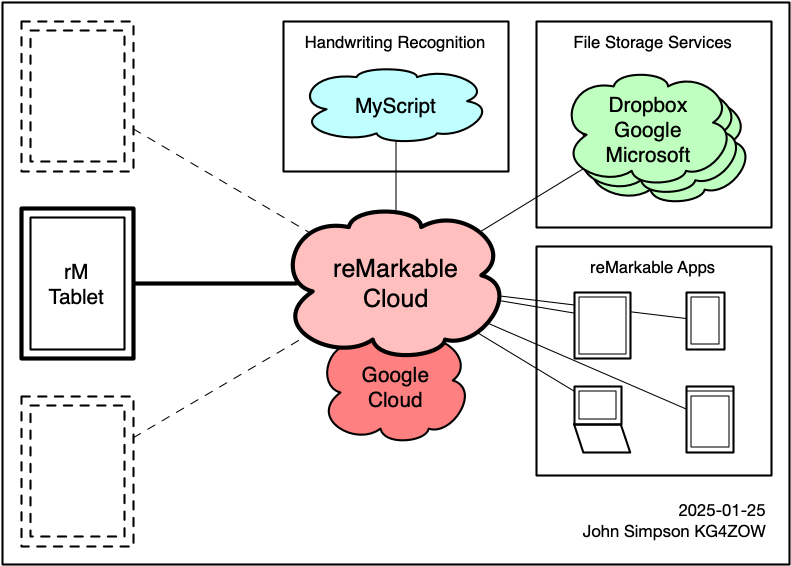

# The reMarkable Cloud Service

reMarkable's cloud service, [reMarkable Connect](https://remarkable.com/store/connect), is designed to store copies of your documents. This allows other clients, such as the reMarkable apps and web site, to work with documents without having to access the tablet directly.

When you edit a document on your tablet, the tablet immediately updates the cloud service with whatever you changed. If another client (desktop/mobile app, or the [my.remarkable.com](https://my.remarkable.com/) web page) uploads a change to the cloud, your tablet will update itself with that change as soon as it receives it from the cloud servers. If the tablet is connected to wifi and able to reach the cloud servers, that update may happen within just a few seconds.

> &#x1F6D1; **The reMarkable cloud service is not a backup service.**
>
> It's a sync service.
>
> The reMarkable desktop and mobile apps all work by talking to a cloud account, and relying on the tablet to sync any changes when they happen. In particular, anything you delete on the tablet will also be deleted from the cloud, and anything deleted from the cloud will also be deleted from the tablet.
>
> Think of it as a *mirror* of your tablet.

reMarkable's overall system was designed around the idea that the tablets would be connected to the Cloud service. The cloud servers handle talking to third-party systems, such as Dropbox, Google, and Microsoft's file storage services, and [MyScript](https://myscript.com/) to perform handwriting recognition.

*I think* part of the reason it was structured this way is because the rM1/rM2 tablets have limited room for software. If the cloud servers talk to these systems, the software on the tablets doesn't need to include code to talk to each of these systems directly.

I'm a visual thinker, I find it easier to understand things when I can *see* them, so I made a quick diagram showing my understanding of how everything talks to each other.

The only things the tablets talk to *other than* the reMarkable cloud servers are ...

* Your local network's router (and DHCP server, if it's on a different machine) to get IPv4 and IPv6 addresses for its wifi interface.
* Google's NTP servers, to synchronize its clock. If the DHCP server tells the tablet to use different NTP servers, the tablet ignores those instructions and uses Google's servers anyway. (The [Clock](../info/clock.md) page explains how to change which NTP servers it uses.)
* reMarkable's update servers, to check for and download software updates. Note that there are two different sets of update servers - one for 3.11 and earlier, and one for 3.12 and later.
* In software version 3.12 and later, the tablet also connects to [Memfault](https://memfault.com/) to send telemetry and analytics. Memfault's web page also says they can handle software updates, but it isn't clear whether reMarkable is using Memfault for this.

# Levels of the Cloud Service

reMarkable's documentation doesn't make this very clear, but there are *three* "levels" of the cloud service - paid, free, and none.

## Paid Service - "Connect Subscription"

Rather than try to explain everything that the paid subscription gives you, I'll refer you to [reMarkable's web site](https://remarkable.com/store/connect), which has a good explanation. To be honest, the service is not overly expensive compared to other "cloud" services I've seen - it's currently USD $3 per month, or $30 per year if you pay for a whole year up front.

I probably *would* use their cloud service, if it weren't for the problems I explain below.

## Free Service

As with the paid service, [reMarkable's web site](https://support.remarkable.com/s/article/Using-reMarkable-without-a-subscription) explains the differences between the paid subscription and the free service, however it's set up as a list of things you *can* do, rather than a list of things you *can't* do.

From what I've read, the limitations are:

* Any document which is not *edited* for 50 days or more, will stop sync'ing with the cloud servers.

    The documents will still *exist* on your tablet and in the cloud, but they will have a "Not syncing" flag on them. Once a document enters this state, any edits you make on the tablet will *not* sync up to the cloud, and updates made using other clients will not sync down to your tablet. They still *appear* in the cloud's web interface, but the cloud won't have any updates you've made on the tablet. Even if you go back and edit it, that document will not *start* sync'ing again.

* Some functionality in the desktop and mobile apps will be blocked. I don't know the details specifically (I've never used the reMarkable apps), however I seem to remember people saying that you can *edit* documents using the desktop/mobile/web apps if you have a paid account, but not a free account.

Otherwise, everything else works the same as with a paid account, including handwriting recognition and third-party file transfers.

### Working around the 50-day limit

If you have documents showing the "Not syncing" flag and you need them to "start syncing" again, there are two ways to do it:

* **Start paying for a subscription.** Once you have a *paid* account, the whole 50-day restriction goes away and those documents will resume sync'ing again.

* **Duplicate the document.** The *copy* will be seen as a new document and start its own 50-day timer. Once it uploads to the cloud, you can delete the original, non-sync'ing document.

Keep in mind that this is "cheating the system". reMarkable *is* providing the cloud service, and it *does* cost them money to pay for the servers, storage, and peoples' salaries to keep it all running. If you're *using* the cloud service and you have the means to do so, it's worth *paying* for the cloud service.

## No Service

This is exactly what it sounds like - your tablet is not linked to a cloud account, and does not talk to reMarkable's cloud servers at all. Any functionality which requires the cloud service, including the reMarkable desktop, mobile, and web apps, handwriting recognition, and access to third-party "cloud storage" services, will not be available.

This is how I use my own tablets ... without the cloud service.

> &#x2139;&#xFE0F; **One testing tablet**
>
> This is no longer true. I own four tablets - rM2 and rMPP purchased new from reMarkable, and rM1 and rM2 bought used from people on [Reddit](https://www.reddit.com/r/RemarkableTablet/). The original rM2 is my "primary" tablet, and contains my real documents, the ones I don't want shared with others.
>
> I did create a cloud account using an Apple ["Hide My Email"](https://support.apple.com/en-us/105078) address, and have one of the "testing" tablets connected to it.

# Why I don't use the Cloud Service

I am NOT connecting my primary tablet to the "reMarkable Cloud" at all. I'm doing this for a few reasons.

## Privacy

Privacy is *very* important to me. Not that I have any great secrets, I just don't like the feeling of somebody (or thousands of somebodies) watching everything I do over my shoulder, especially if they are using that information against me (by targeting ads, training AI models, or whatever else they do with it), without my permission or knowledge.

reMarkable has pretty much designed the tablet's software to keep everything synchronized to their "cloud", which is hosted on Google's "cloud" in Europe.

There *are* some benefits in doing it this way.

* If your tablet is damaged or lost, you can buy another tablet and sign it into the same account, and your documents will sync back from the cloud. (As long as the documents haven't "disappeared" from the cloud.)

* It allows the reMarkable apps on your computer or phone to access the cloud and work with documents on the tablet, without needing to connect to the tablet itself.

* If you own multiple tablets, it's the easiest way to synchronize documents between those tablets.

However.

Synchronizing the tablet to the cloud means that copies of all of your content - every notebook, every "quick sheet", every PDF or EPUB file you upload into the tablet - are uploaded to their cloud. There is no way to choose which documents are or are not uploaded, it's "all or nothing" - and the only way to choose "nothing" is to not connect to the cloud at all.

The files in the cloud are encrypted before being written to Google's disks. However, it's not clear who holds the keys for it, reMarkable or Google. Whoever it is, it means that your files can be read by reMarkable (and maybe Google) employees, along with any government agencies (from *any* country) who ask, along with any random anklebiter who manages to hack into reMarkable's (or maybe Google's) systems. (Because as we all know, large companies who pay obscene amounts of money for dedicated security staff [never get hacked](https://techcrunch.com/2023/07/17/microsoft-lost-keys-government-hacked/).)

These people can also *change* what's in the cloud, and your tablet will happily download those changes, changing or deleting the content on your tablet, however *somebody else* wants.

It IS possible to structure a cloud service in such a way that the files in the cloud are "end-to-end" encrypted, with the encryption keys only available to the devices and apps attached to the account. ([Keybase](https://keybase.io/) is a good example of this, each *device* has its own encryption keys.) reMarkable didn't structure their cloud service this way, and as a result, any files created or side-loaded on a reMarkable tablet which connects to the cloud service are available to hundreds of reMarkable (and maybe Google) employees, thousands of government employees (for various values of "government"), and unknown hordes of "hackers".

## Security of Third Party Services

reMarkable offers integrations with third-party file storage services, currently including Dropbox, Google, and Microsoft. The file transfers to/from these services are done by the reMarkable cloud servers. Your tablet never talks to these other services directly.

Part of setting up each file-sharing integration involves generating a security token that gives the reMarkable servers access to your accounts on these other providers. These tokens are held on reMarkable's servers.

reMarkable employees, government agencies, or random hackers who get into reMarkable's systems are able to access those tokens, and are therefore **able to access everything in your accounts on these other services**, whether it has been copied to your tablet or not.

### Compliance/Legal

The US has a law called the Health Information Portability and Accountability Act, or [HIPAA](https://en.wikipedia.org/wiki/Health_Insurance_Portability_and_Accountability_Act), which governs how healthcare information is handled. Part of this law says that companies who *have* peoples' healthcare information are not allowed to share that information with others except under specific circumstances.

My current `$DAYJOB` is with a company in the healthcare industry. My particular job (software development, system and network administration, "DEVOPS", and other related "technical" things) doesn't involve *regular* exposure to PHI (protected health information), however I do sometimes need to deal with log files containing small bits of PHI. This means that if I were using the reMarkable cloud, I would have to be careful about writing down any information from those log files, because *legally* that information cannot be shared with outsiders (including reMarkable or google).

HIPAA has a provision where companies *having* others' healthcare information can sign a Business Associate Agreement (or BAA) with another company, where the second company agrees to be equally liable with the first company in case of a breach. Without a BAA in place, it is not *legal* for a US healthcare worker to write any patient information into a tablet connected to the reMarkable cloud service.

**If you are a healthcare worker in the US and you don't have a BAA with reMarkable, it is a HIPAA violation to write any patient information in a reMarkable tablet which is linked to a reMarkable cloud account.** If there is a data breach in reMarkable's servers, or in the Google storage servers which hold reMarkable's data, you can be fined for it - just the same as if you had left a copy of a patient's records sitting on your desk and *another* patient saw them.

For several years reMarkable offered to execute a BAA with any customer who asked, but in 2024-02 they *removed* this offer from their [Terms and Conditions](https://support.remarkable.com/s/article/Terms-and-Conditions-reMarkable-Accounts) page. Section 7 used to have an entire paragraph which explained how to execute a BAA with them, and included a link to download a PDF of the BAA itself.

The fact that they had this but then removed it, suggests to me that they finally realized that their cloud service is not HIPAA-compliant, and they are no longer willing to take the chance of being liable in case of a breach.

They have not, however, notified existing customers who *have* a BAA, that those agreements will be cancelled at some point.

### Functionality

The news is full of stories about companies who design their products to connect to a "cloud" service of some kind, and then when the company later decides to stop providing the cloud service (or goes out of business entirely), those products suddenly stop working.

**When I buy a product, I expect that product to still be able to do its job if the manufacturer goes out of business.**

In the case of the reMarkable tablet, I figure if I don't connect to their cloud service in the first place, it won't matter if the cloud service suddenly isn't available anymore.

# How I don't use the Cloud Service

There are certain things I can't do without the cloud service, but I have found work-arounds and/or other tools which provide the functionality I need.

## Backups

I have no need for a "sync service", however I do need to be able to back up my documents on a regular basis.

The [Backing Up the Tablet](../info/backups.md) page has more details about the programs I've written to back up reMarkable tablets.

## Uploading Documents

The tablets have a built-in web interface which allows you to upload and download documents. It can import PDF, EPUB, and `.rmdoc` files. reMarkable's directions for how to enable and use this interface are on [this page](https://support.remarkable.com/s/article/importing-and-exporting-files) - click "How to enable USB transfer on your reMarkable" near the bottom of the page.

I *have* used the web interface to upload documents in the past, however there have been a few times when uploading a file just plain didn't work, and I had to reload the browser window and try again. (Once or twice I've had to reload the browser window *up to three times* before an upload worked.) I haven't tried it enough to be able to track it down to a specific tablet or a specific USB cable.

### RCU

[RCU](http://www.davisr.me/projects/rcu/) is a third-party program for managing the contents of your tablet. It can ...

* Upload and download notebooks (documents).
* Upload and download custom templates (background images which can be assigned to individual pages in a notebook).
* Upload custom splash screens (sleeping, powered off, overheating, etc.)
* Manually install new software images.
* Provide a "virtual printer" on the computer. Any program on the computer can "print" to it, and the output shows up as a PDF-backed notebook on the tablet. (I use this fairly regularly.)

It connects to the tablet using SSH, so if you have an rMPP it requires that the tablet be in "devloper mode".

## rmfakecloud

[rmfakecloud](https://ddvk.github.io/rmfakecloud/) is a project which duplicates most of the "cloud sync" functionality, but hosted on a server that YOU control.

This includes handwriting recognition, by talking to [MyScript](https://www.myscript.com/) (the same third-party service that reMarkable uses to perform handwriting recognition for cloud users). If you do this, you do have to get your own service with MyScript if you plan to use the handwriting recognition functionality. MyScript's service charges based on the number of "recognition events" you perform each month.

My guess is that reMarkable has some kind of volume discount with MyScript. reMarkable pays MyScript for all handwriting recognition requests made by all tablets connected to the reMarkable cloud service. If your tablet is connected to rmfakecloud and you use the handwriting recognition function, you would need to make your own arrangements with MyCloud to pay for that service.

[This page](https://developer.myscript.com/pricing) contains what little they're willing to say about pricing - basically the first 2000 requests each month are free, and after that, "contact us". An [old message](https://developer-support.myscript.com/support/discussions/topics/16000030978) on their developer support forum mentions the pricing beyond that as $10 per 1000 requests, I have no idea if that's still accurate or not.

**I have not played with rmfakecloud yet, however it is on my list of things to check out.**

Also, it's worth pointing out that rmfakecloud uses the *original* cloud API. The last I heard, the tablet software was capable of using either the old *or* new version of the API, but it's possible that versions released after reMarkable changed their servers to use the newer API are no longer able to "speak" the older API. This means you might need to downgrade your tablet to an older OS if you want to use rmfakecloud.
