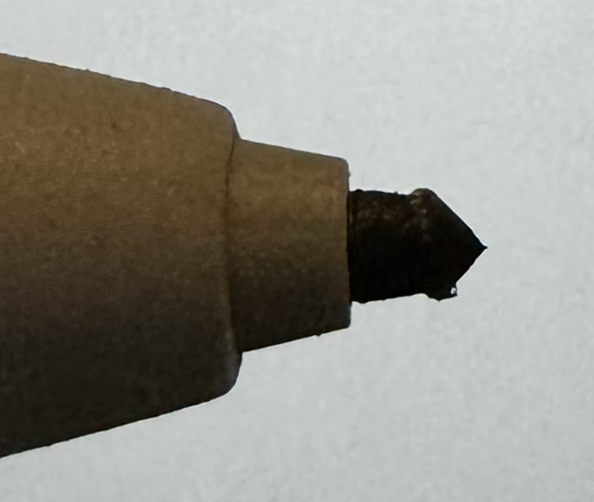

# Nibs

The term "nib" refers to the pointed tip on a stylus that comes in contact with the tablet's screen while you're writing.

**The nibs are replacable, because they are *designed* to be replaced.**

When you write on the screen, it generates friction. Over time, the friction will "wear down" the nib, and the pointed tip on the nib will become deformed. This will happen overtime, and will happen faster or slower for different people, depending on how hard they press down while writing.

This is a close-up of the nib on one of my stylii:

This is an original reMarkable nib that I've been using for about 2&#xBD; months. Even shaped like this, I find that the stylus is still fairly accurate when writing on the tablet.

Different people press down harder than others while writing, and as a result, nibs will last longer for some people than others. I figure this particular nib will be good for *at least* another month or two before it will need to be replaced.

In addition, the *shape* of the deformity will vary depending on whether you hold the stylus *exactly* the same way every time you use it. I usually hold it at the same angle relative to the screen, but the stylus itself may be rotated in any direction in my hand (i.e. sometimes the "reMarkable" label will be facing up, sometimes down, and sometimes at an angle in between), so the wear on this nib seems to be about the same "all the way around".

## Metal Nibs

A lot of people seem to be interested in using nibs made of a metal, especially titanium. The idea is that metal nibs are supposed to be better because won't wear down over time.

Whenever two things rub against each other it creates friction, which causes one (or maybe both) of those things to wear down over time, usually whichever thing is softer. In the case of a reMarkable tablet, the nib and the screen rub against each other when you write. *Normally* the nib is softer than the tablet's screen, so the nib is what wears down.

However.

**If the nib is harder than the screen, then it will be the screen that wears down.** Or more specifically, the *coating* that reMarkable puts on the screen which gives it the "paper-like" feeling, will wear down, and then if you keep going, it could start wearing down the screen itself.

### My own experience

I bought [two titanium nibs](https://www.amazon.com/dp/B0BF9WJ8VX) for my stylii, and tried using one for three days. To me felt a little bit "smoother", more like writing with a ball-point pen than with a pencil. I didn't notice any degradation on the screen coating, but under the theory of "better safe than sorry", I don't use them anymore.

I also picked up [30 plastic nibs](https://www.amazon.com/dp/B0BWX873ZX), and have had one of them in the stylus in my "experimentation" tablet for the past few months. To me it "feels" the same as writing with a reMarkable nib.

### Longevity

Each reMarkable stylus came with one nib installed and nine extras. These, along with the 30 that I purchased, makes a total of 50 nibs. If each one lasts me three months, that gives me 150 months' worth of writing. *That's 12&#xBD; years*. I don't expect the *tablets* to last that long.

### Conclusion

For me it made more sense to spend $12 for "all the nibs I'll ever need", than to spend $19 for two nibs that may or may not end up damaging the tablet. I tried to return the titanium nibs, but I guess it would cost Amazon more to ship them back to a warehouse than they made in profit, because they refunded my money and said to just throw them away.
