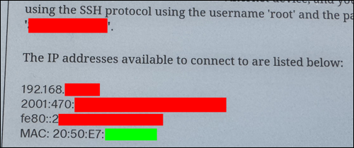

# Controlling the Network

When I first got my reMarkable tablets, I didn't connect them to wifi at all. I did this because I didn't want there to be any chance of the tablet connecting to the outside world without my knowledge. Later, I set up my home network so that the tablets are able to talk to other devices within my home, but cannot connect to the outside world.

This page will explain how I configured my network.

### Networking Equipment

**The examples on this page will be specific to the networking hardware I use for my network.** I don't use a normal consumer-grade router, because most of them cannot be configured to do the things I'm doing with my home network. I've been managing networks since 1996, up to and including several ISPs in Florida, and there are things I'm used to being able to do, which most consumer routers don't provide a way to do.

My home router, access point, and a few other secondary routers that I use for experimentation, are all made by [MikroTik](https://mikrotik.com/). I like their equipment because it is VERY configurable, and because it's affordable. They use the same "RouterOS" software across their entire line of routers and access points, so the same commands I know from one router will work with any of them, whether it's my [home router](https://mikrotik.com/product/RB1100Dx4), [access point](https://mikrotik.com/product/cap_ac), or one of their [smaller](https://mikrotik.com/product/RB952Ui-5ac2nD) [routers](https://mikrotik.com/product/RBmAPL-2nD). They all use the exact same software, and are capable of doing everything described below (although some of the smaller routers probably wouldn't be able to process the packets as quickly as the bigger ones).

The examples below use the MikroTik command line interface. MikroTik routers *do have* a web interface, but I rarely use it - I've been administering systems for a long time and I find it easier to do things from a command line. Plus, it's a lot easier for me to just show the commands and responses than it is to type out lists of "go to this web page, click this link, open this menu, click this checkbox" over and over. Eerything below *can* be done using the MikroTik web interface, but I don't normally use the web interface (other than looking at traffic graphs) so I can't really offer specific directions for how to do this using the web interface.

If you're following along with a MikroTik router, the directions below assume that you are SSH'd into the router, as a user with admin rights.

### IPv4 vs IPv6

There are two versions of the IP protocol in general use today.

* **IPv4** uses 32-bit addresses, usually written as four decimal numbers with dots between them, like "`198.51.100.37`". There are a total of 2&#xB3;&#xB2; possible IPv4 addresses, and some are reserved for specific purposes and cannot be used, so the total number available is around 4 billion.

    These addresses have been in use since the early 1970's. As I'm writing this (2024-02-04), almost all available IPv4 addresses in the world have been allocated. North America is totally out of them, and has a [waiting list](https://www.arin.net/resources/guide/ipv4/waiting_list/) for new IPv4 addresses. Other RIR's have imposed strict rules about how many IPv4 addresses can be requested and/or held by any one company or person.

* **IPv6** uses 128-bit addresses, normally written as a series of hexadecimal numbers with colons between them, like "`2001:db8::dead:beef:c0:ffee`". There are a total of 2&#xB9;&#xB2;&#x2078; (340,282,366,920,938,463,463,374,607,431,768,211,456, or over 340 trillion trillion trillion) possible IPv6 addresses. This is enough addresses that I couldn't find a web site who was willing to even *guess* when we would start running out of IPv6 addresses.

The ISP who provides my home's connection to the internet doesn't offer IPv6, however Hurricane Electric's free [Tunnelbroker](https://tunnelbroker.net/) service is routing a block of "real" IPv6 addresses into my home network. This allows me to connect to services which are only available via IPv6 (such as the [`ipv6.jms1.net`](https://ipv6.jms1.net/) site, which I originally set up as a way to test IPv6 connectivity and just haven't bothered to remove).

MikroTik routers *can* block outbound IPv6 traffic from specific devices, however it needs to be done differently because IPv6 handles dynamic address allocation differently than IPv4 (it uses [SLAAC](https://www.rfc-editor.org/rfc/rfc4862) instead of DHCP).

# Blocking IPv4 Traffic

When a device (like a reMarkable tablet) connects to wifi, it uses a protocol called DHCP (Dynamic Host Configuration Protocol, detailed in [RFC-2131](https://www.rfc-editor.org/rfc/rfc2131)) to request an IPv4 address. This request is sent as a "broadcast" packet, meaning that every other device on that network segment will see it. This request is basically saying "Hey everybody, I'm here, can somebody tell me what IPv4 address to use?"

If another device on the network is running a "DHCP Server", it will respond to these requests with a message saying "use this address and subnet mask, and here are some other useful settings, for this amount of time". When the client receives this response, it configures its network interface, routing table, and (usually) DNS resolver with the values from that response, and starts talking to the world.

Most DHCP servers are configured with a "pool" of IPv4 addresses, available to be assigned to any client who asks for one. Many (but not all) DHCP servers can also be configured with "reservations". A reservation is a rule which says that if a *particular* client asks for an IPv4 address, it should always give them a specific address, and it should never give that address to any other client.

> &#x2139;&#xFE0F; **Reservations vs Static Addresses**
>
> **Reservations** are set up in the DHCP server. The client performs the same DHCP request process it normally would, the difference is that it always happens to get the same answer.
>
> **Static Addresses** are configured on the device itself, and don't use DHCP. When the interface starts up, the computer already knows the correct IPv4 address, subnet mask, and other setting to use, so it just configures those and starts talking.

## Find the Tablet's MAC address

DHCP reservations require two pieces of information: the MAC address of the client, and the IPv4 address to assign to that client.

Clients are identified using MAC addresses. These are unique identifiers for every hardware interface (i.e. ethernet port, wifi radio, etc.) MAC addresses are assigned during manufacturing and generally cannot be changed. They are normally written in a format which looks like "`12:34:56:AB:CD:EF`". They are not case-sensitive, i.e. if they have any letters, they may be written using upper- or lower-case, without changing the meaning.

If you're SSH'd into the tablet, you can find the wifi interface's MAC address like so:

```
root@reMarkable:~# ip link show dev wlan0
3: wlan0: <BROADCAST,MULTICAST,UP,LOWER_UP> mtu 1500 qdisc pfifo_fast qlen 1000
    link/ether 12:34:56:ab:cd:ef brd ff:ff:ff:ff:ff:ff
```

In this example, `12:34:56:ab:cd:ef` is the MAC address. (Obviously I changed it for this web page.)

If not, you can see the MAC address of the wifi interface by going to:

* Setttings
* Help
* Copyrights and licenses

At the bottom of this page, below the root password, will be a list of the tablet's IPv4 and IPv6 addresses. The MAC address of the wifi interface will be the last item on this list.



I've obfuscated the specific values from my own tablet, however the green box at the bottom of the picture is what you're looking for. Note that your tablet may not look exactly like this - in particular, you may not have any IPv6 addresses on your list, and if you aren't connected to wifi, you won't have an IPv4 address either. However, the MAC address should always be there.

## If Converting from Dynamic to Reserved

If you don't really care what the tablet's IPv4 address is, your router may offer a way to convert its current lease from dynamic to reserved. (Your router may call this something else, possibly with the word "static" in it. If it's asking for a MAC address, they're talking about a reservation, which is different from a static address.)

To do this with a MikroTik router ...

* Make sure the tablet is connected to wifi. You should see the wifi logo at the bottom of the tablet's screen while you're in a "file browser".

    

* Find the tablet's current DHCP lease. (Use the tablet's MAC address in the command shown below.)

    ```
    [admin@MikroTik] > /ip dhcp-server lease print where mac-address="12:34:56:AB:CD:EF"
    Flags: X - disabled, R - radius, D - dynamic, B - blocked
     #   ADDRESS            MAC-ADDRESS       HOS... SERVER    RAT... STATUS
     0 D ;;; reMarkable tablet rm2b
         192.168.1.202      12:34:56:AB:CD:EF        internal         bound
    ```

* Note the number at the beginning. If you used "`when mac-address="..."`" this should be `0`.

* Change the reservation from dynamic to static. (The number at the end of the command is the number from the list above.)

    ```
    [admin@MikroTik] > /ip dhcp-server lease make-static 0
    ```

* If you look at the lease again, the "`D`" flag after the number should be gone.

    ```
    [admin@MikroTik] > /ip dhcp-server lease print where mac-address="12:34:56:AB:CD:EF"
    Flags: X - disabled, R - radius, D - dynamic, B - blocked
     #   ADDRESS            MAC-ADDRESS       HOS... SERVER    RAT... STATUS
     0   ;;; reMarkable tablet rm2b
         192.168.1.202      12:34:56:AB:CD:EF        internal         bound
    ```

## If Manually Choosing the IPv4 Address

If your router doesn't offer a way to convert a dynamic lease to a reservation, or if you don't *want* to do this, you can choose the IPv4 address yourself.

I actively manage the IP space within my home network. I do *have* DHCP pools available, but any device that I might ever need to connect TO, has either a static or reserved IP address. Since the reMarkable software didn't include a way to set static IPs for different wifi networks, I had to set up DHCP reservations on the router for each of my tablets.

### Choose the IPv4 Address

In my case, I already had ranges of IPs allocated for different types of devices, so I knew what IPs I wanted for each tablet. I'm not going to go into a bunch of detail about how to manage IP networks, but in general if you're assigning an IP to a new device, you're going to need an IP address which is ...

* within the appropriate subnet
* not within the DHCP pool
* not being used by any other devices

As an example, if ...

* the router's internal network is `192.168.1.0/24`
* the DHCP pool is `.100` to `.199`
* the router itself is using `192.168.1.1`
* other Linux servers are using `.10` through `.23`
* a printer is using `.250`
* all other devices on the network use DHCP, so they have addresses in the `100` to `199` range.

In this example, I might choose `192.168.1.201` for the tablet, since it's in the correct subnet, it's not within the DHCP pool, and it's not being used by any other devices. (I'll use this address in the examples below.)

### Set up the DHCP reservation

* Find the name of the correct `dhcp-server` process. (If the router is acting as a DHCP server for multiple interfaces, it will have a different process for each interface.)

    ```
    [admin@mikrotik] > /ip dhcp-server print
    Flags: D - dynamic, X - disabled, I - invalid
     #    NAME      INTERFACE    RELAY           ADDRESS-POOL    LEASE-TIME ADD-ARP
     0    internal  internal                     internal        1d
     1    guest     guest                        guest           1d
     2    iot       iot                          iot             1d
    ```

    In this example, there are three different network segments for which the router provides DHCP, so there are three DHCP server processes. In this case, the server we're going to add the reservation to is called "`internal`".

* If the tablet is currently connected, disconnect and "forget" the network.

* If the tablet was previously connected, delete its current lease.

    * First find the lease(s) ...

        ```
        [admin@MikroTik] > /ip dhcp-server lease print where mac-address="12:34:56:AB:CD:EF"
        Flags: X - disabled, R - radius, D - dynamic, B - blocked
         #   ADDRESS            MAC-ADDRESS       HOS... SERVER    RAT... STATUS
         0 D 192.168.1.201      12:34:56:AB:CD:EF        internal         bound
        ```

        Note the number at the beginning of the line, in this case `0`.

    * Then delete the lease.

        ```
        [admin@MikroTik] > /ip dhcp-server lease remove 0
        ```

* Add the DHCP reservation.

    ```
    /ip dhcp-server lease add \
        server=internal \
        mac-address=12:34:56:ab:cd:ef \
        address=192.168.1.201 \
        comment="reMarkable Tablet"
    ```

    (This is one long command, I use backslashes (the "`\`" characters) to "wrap" the command so it's easier to read. You can copy/paste this into the MikroTik command line, it handles backslashes the same way that most other command line interfaces do.)

* Connect the tablet to the network.

### Make Sure it Worked

Go to "Settings &#x2192; Help &#x2192; Copyrights and licenses" and check the tablet's IP. It should have the IP you added to the DHCP reservation.

## DNS Entry

I also have my own DNS servers for my internal network. Because my tablets all have reserved IPv4 addresses, I was able to add DNS entries for each of their hostnames, and now I can SSH into them without having to remember what their wifi IPv4 addresses are.

```
$ ssh rm2b
ｒｅＭａｒｋａｂｌｅ
╺━┓┏━╸┏━┓┏━┓   ┏━┓╻ ╻┏━╸┏━┓┏━┓
┏━┛┣╸ ┣┳┛┃ ┃   ┗━┓┃ ┃┃╺┓┣━┫┣┳┛
┗━╸┗━╸╹┗╸┗━┛   ┗━┛┗━┛┗━┛╹ ╹╹┗╸
root@reMarkable:~# exit
```

## List of Restricted IPv4 Addresses

This section involves setting up a list of IPv4 addresses whose traffic will be blocked from accessing the outside world.

One option for this is to add a separate rule which blocks traffic *from* each IP address. However, my network has over a dozen devices that I don't want talking to the outside world, so instead I created a list of IPv4 addresses whose traffic is restricted, and then added a *single* firewall rule to block traffic FROM the IPs on this list, TO the "external" interface.

### Create or Add to the List

This will create an IP address list called "`restricted`", with the IPs of my three tablets as members. (If such a list already exists, it will add the IP addresses to it.)

```
/ip firewall address-list add \
    list=restricted \
    address=192.168.1.201 \
    comment="reMarkable tablet rm2a"
```

```
/ip firewall address-list add \
    list=restricted \
    address=192.168.1.202 \
    comment="reMarkable tablet rm2b"
```

```
/ip firewall address-list add \
    list=restricted \
    address=192.168.1.203 \
    comment="reMarkable tablet rm1c"
```

On my home network, I already had a `restricted` list with the IPs for several other devices, such as light switches that I can control using Apple's "Home" app, and a network-enabled printer that I don't want "phoning home" without my knowledge. Talking to other devices inside my home is fine, but talking to anything outside my home is not.

When I got the tablets, all I had to do was set up their DHCP reservations and add their IPs to this list, before allowing them to connect to wifi for the first time.

## Block Outbound Traffic

The last step is to add a firewall rule which either rejects or drops packets *from* an IP on the `restricted` list, *to* the outside world.

> &#x2139;&#xFE0F; **Reject vs Drop**
>
> If the router REJECTs a packet, it sends a "not allowed" message of some kind back to the source of the packet.
>
> If the router DROPs a packet, it doesn't tell the sender anything. The sender won't be told that the packet was not delivered, the packet just won't *go* anywhere.
>
> Either way, the tablet won't be able to talk to the outside world - the difference is whether it *knows* it's being blocked or not.

### Get External Interface Name

We're going to need the name of the interface which connects to the outside world. This will usually be obvious by looking at the IPv4 addresses of the router's interfaces, because only one of them will have a "real world" IP address (i.e. one that isn't in the `10.x.x.x`, `172.(16-31).x.x`, or `192.168.x.x` ranges).

```
> /ip address print
Flags: X - disabled, I - invalid, D - dynamic
 #   ADDRESS            NETWORK         INTERFACE
 0   192.168.88.5/24    192.168.88.0    internal
 1 D x.x.x.146/24       x.x.x.0         uplink
 2   192.168.1.1/24     192.168.1.0     internal
 3   192.168.2.1/24     192.168.2.0     iot
 4   192.168.3.1/24     192.168.3.0     guest
```

On my router, I've assigned better names to the interfaces so I don't have to remember which router ports are connected to which network segments.

* The `internal`, `iot`, and `guest` interfaces are bridges, each containing a collection of the appropriate ethernet ports and VLANs. (The ethernet port connecting to my wifi access point is special - it carries several VLANs, and the AP connects different VLANs to different SSIDs.)

* As for the `uplink` interface, I just renamed `ether12` to `uplink` so I don't have to keep in the back of my head which port is connected to the ISP's equipment.

In this case, `uplink` is the name of the interface which connects to the outside world.

### Figure out where to put the rule

The firewall rules exist in a specific order. Each packet which enters the router is evaluated by these rules, and the first rule which matches the packet controls what the router does with that packet. The rules are numbered, and when you add a rule, you can specify where the new rule should be in the order. If you don't specify where to put it, the router will put it at the end of the list.

When a MikroTik router is brand new or is reset, it configures a default set of firewall rules that work similar to a typical home router, i.e. with one port as an "uplink" and all of the others bridged together as a single internal network. This includes the necessary firewall and NAT rules to allow internal machines to reach the outside world, but no traffic inbound from the outside world. These rules all have "`defconf:`" at the beginning of the description.

In many cases, this rule will need to be added immediately after those `defconf:` rules.

For example ...

```
[admin@MikroTik] > /ip firewall filter print
Flags: X - disabled, I - invalid, D - dynamic
 0  D ;;; special dummy rule to show fasttrack counters
      chain=forward action=passthrough

 1    ;;; defconf: accept ICMP
      chain=input action=accept protocol=icmp

 2    ;;; defconf: accept established,related
      chain=input action=accept connection-state=established,related

 3    ;;; defconf: drop all from WAN
      chain=input action=drop in-interface=uplink

 4    ;;; defconf: fasttrack
      chain=forward action=fasttrack-connection
      connection-state=established,related

 5    ;;; defconf: accept established,related
      chain=forward action=accept connection-state=established,related

 6    ;;; defconf: drop invalid
      chain=forward action=drop connection-state=invalid

 7    ;;; defconf:  drop all from WAN not DSTNATed
      chain=forward action=drop connection-state=new
      connection-nat-state=!dstnat in-interface=uplink

 8    ;;; FORWARD: certain guest devices are allowed to print
      chain=forward action=accept src-address-list=can-print
      dst-address-list=printers

 9    ;;; FORWARD: guests cannot access internal network
      chain=forward action=reject in-interface=guest out-interface=internal
...
```

On this router, the rule needs to be between 7 and 8.

### Add the rule

To add the rule ...

```
/ip firewall filter add \
    place-before=8 \
    chain=forward \
    action=reject \
    src-address-list=restricted \
    out-interface=uplink \
    comment="FORWARD: restricted devices cannot get out"
```

If you list the rules again, you should see the new rule, in the correct order.

```
[admin@MikroTik] > /ip firewall filter print
...
 7    ;;; defconf:  drop all from WAN not DSTNATed
      chain=forward action=drop connection-state=new
      connection-nat-state=!dstnat in-interface=uplink

 8    ;;; FORWARD: restricted devices cannot get out
      chain=forward action=reject src-address-list=restricted
      out-interface=uplink

 9    ;;; FORWARD: certain guest devices are allowed to print
      chain=forward action=accept src-address-list=can-print
      dst-address-list=printers

10    ;;; FORWARD: guests cannot access internal network
      chain=forward action=reject in-interface=guest out-interface=internal
...
```

Once the rule is in place, the reMarkable tablets (and any other devices whose IPs are on the `restricted` list) will not be able to "talk to" anything which is only reachable via the `uplink` interface ... namely, anything outside the home network.

# Blocking IPv6 Traffic

IPv4 and IPv6 traffic are handled entirely separately from each other. Even if a device (like a reMarkable tablet) isn't able to reach the internet via IPv4, it may still be able to reach it via IPv6, so we also need to block IPv6 traffic coming from the tablet.

IPv6 devices will generally self-assign their IPs, using a prococol known as SLAAC (Stateless Address Autoconfiguration, [RFC-4862](https://www.rfc-editor.org/rfc/rfc4862)). The reMarkable tablet does this, and it doesn't have a way to set a static IPv6 address, so this is the only way it can get an IPv6 address.

The IPv6 address assigned via SLAAC itself is predictable, however there are "privacy extensions" which will make the tablet choose a random IPv6 address instead of, or in addition to, the SLAAC address. Because of this, the only reliable way to filter traffic coming from the tablet is to match based on the MAC address instead of any IPv6 address. (This is one of those things that most ritters cannot do.)

We can't add MAC addresses to an `address-list`, so instead we'll need to make the router "mark" each packet when it arrives from the tablet's MAC address, and then refuse to forward packets with this "mark" to the outside world.

> &#x2139;&#xFE0F; **Marks**
>
> These "marks" are just extra tags which are attached to the packets while they're in the router's memory. They are not sent along when the packet leaves the router.
>
> The mark itself can be any string you like, I use "`internal-only`" for this.

## Mark Packets from Restricted Devices

The first part of this is to add an "`internal-only`" mark to all packets arriving from the MAC addresses of the restricted devices. (The mark itself can be anything, I used "`internal-only`" so it's obvious what it's being used for.)

```
/ipv6 firewall mangle add \
    chain=prerouting \
    action=mark-packet \
    new-packet-mark=internal-only \
    src-mac-address=12:34:56:AB:CD:EF \
    comment="reMarkable tablet rm2b"
```

Each MAC address whose IPv6 traffic needs to be restricted, will need a rule like this.

## Block the Marked Packets

If your router has real-world IPv6 connectivity, you should already have IPv6 firewall rules in place. If not, MikroTik's [Building Your First Firewall](https://help.mikrotik.com/docs/display/ROS/Building+Your+First+Firewall) page has information about how to set up reasonable firewall rules for both IPv4 and IPv6.

I'm assuming you have rules in place, and just need to add the rule which blocks packets from the restricted devices. That rule will look like this:

```
/ipv6 firewall filter add \
    chain=forward \
    out-interface=uplink \
    packet-mark=internal-only \
    action=reject \
    comment="FORWARD: reject outbound packets with internal-only mark"
```

Note that the `out-interface=` should match the interface through which the outbound IPv6 traffic leaves the router. On my router this is the 6to4 tunnel interface which connects to the [`tunnelbroker.net`](https://tunnelbroker.net) service.


# Traffic is controlled

After adding these rules in the router, the tablet can connect to wifi and speak with other devices on the local network, but cannot reach the outside world.

This has allowed me to experiment with [clock synchronization](clock.md), I have a Linux server at home which is able to pull backups from the tablet every hour (not that there's a lot to save, but as a concept it works), and it will also make it possible for me to set up [rmfakecloud](https://ddvk.github.io/rmfakecloud/) in the future.


# Telemetry

The tablet's filesystem has a `/home/root/.cache/remarkable/xochitl/telemetry/` directory, containing an ever-growing collection of files containing what appears to be a collections of strings containing just `1` and `0`.

When I've seen "telemetry" files in the past, it was because the device was uploading information somewhere, usually to the hardware or OS manufacturer, about what the machine was doing. As a rule I'm not comfortable with uploads happening without my knowledge or consent, especially when I can't tell what information is being sent.

I asked about these files on the `rcu-develop` list (for [RCU](http://www.davisr.me/projects/rcu/) users who are more "technically minded"). A few people were *aware* of them, but nobody had any real information about what they were used for or what information they contain.

I did notice that, after connecting to wifi for the first time, the tablet *did* try to open a connection to `ping.remarkable.com:443` (`34.36.20.125`).
I don't *know* that this connection was related to these telemetry files or not, it's possible this was something totally unrelated.

I've tried setting up a packet sniffer on the router to capture all traffic to/from the tablet, but this particular connection hasn't happened again. I'm hoping that if it does, there will be a DNS request just before it tries to connect and the hostname it's querying for will tell me something.
