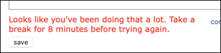

# Introduction

## 2025-02-01: Reddit has suspended my account

As you may know, I *used to* spend a lot of time on the [/r/reMarkableTablet](https://reddit.com/r/reMarkableTablet/) subreddit, answering questions for people. I did this because I genuinely enjoy sharing my knowledge with others, and because it wasn't something I *had* to do as part of my day job.

On 2025-01-30, while I was looking at a picture somebody had submitted to illustrate a problem, I noticed a red banner behind the picture saying something like "this account has been suspended". At first I thought it was talking about the account which had posted the picture, but then I started noticing the same red banner at the top of every new page I opened. And when I checked my email, I found a message from reddit saying ...

> Hi u/kg4zow,
>
> At Reddit, we’re always watching out for your privacy, safety, and security. Recently, after detecting some technical irregularities on your u/kg4zow account, we took the extra precaution of locking your account.
>
> To unlock your account, [reset your password now](/).
>
> We recommend choosing a new password that you haven’t used on Reddit or another website or app before.
>
> To prevent your account from potential misuse, you won’t be able to take part  communities or update the majority of your settings while your account is locked. Also, when you log in you’ll see a red warning and a security message like this one asking you to reset your password.
>
> If you have have questions about locked accounts or your Reddit security, check out our FAQs:
>
> [My account has been locked as a security precaution](https://www.reddithelp.com/en/categories/account-status/my-account-has-been-locked-security-precaution)
>
> [I need help with a hacked or compromised account](https://www.reddithelp.com/en/categories/using-reddit/your-reddit-account/i-need-help-hacked-or-compromised-account)

I reset my password (changed from one long [1Password](https://1password.com/)-generated string of random characters to another one), but after that I started seeing warnings like this whenever I tried to answer a question:

At the time I opened a "support ticket" with reddit about this, but I never heard back.

Today I received an email from another reddit user, asking why I had *cancelled my reddit account*. I reloaded my browser window and was still logged in, so I found [a new question](https://www.reddit.com/r/RemarkableTablet/comments/1if8s22/backup_without_connect/) that I was able to help with. I typed up [an answer](https://www.reddit.com/r/RemarkableTablet/comments/1if8s22/backup_without_connect/maeqmbk/) and submitted it, and when I look at the question in my browser it shows my answer at the bottom ... but if I look at the same question from a browser that isn't logged into my account, *my answer isn't there*.

So apparently my account is still suspended, and reddit is "hiding" the fact from me while telling the rest of the world about it. (This sounds a lot like a "shadow ban" to me, even if it has nothing to do with politics.)

I just opened a second ticket with them about this, asking for a second time, what SPECIFICALLY I did that triggered all this.

**Until reddit decides to fix this, I'm not able to use it.** Which means that if anybody has questions that I *could* help with, I'm not able to do so.

### In the meantime

If you have questions that I might be able to help with, I recommend the following:

* I'm not going to stop maintaining this site - *when I have time*. Of course, this means you need to come back and *check* the site every so often, but if you use  [RSS](https://en.wikipedia.org/wiki/RSS), I have an [RSS feed](https://remarkable.jms1.info/commits.xml) which is updated every time I publish a new version of this web site.

* I'm also not going to stop maintaining my programs on Github - again, *when I have time*. If you have questions about scripts in the [rm2-scripts repo](https://github.com/kg4zow/rm2-scripts), or about the [rmweb](https://github.com/kg4zow/rmweb) program, feel free to ask there. (I *just* turned on the "Discussons" feature for both repos, I've never used them before so it might take a bit for *me* to figure out how they work.)

* The [remarkable.guide](https://remarkable.guide/) site has answers to many of the questions that show up regularly on reddit. They tend to be a lot shorter than the "books" that I typically write - they focus only on "how" to do something, rather than "why" you do it that way. My brain doesn't work that way, but a lot of people seem to prefer that.

* The [Community Discord](https://discord.gg/JSSGnFY) has people who are able to answer a lot of the questions that show up on reddit. They're also able to answer questions that are a LOT more technical than anything that shows up on reddit. I am `kg4zow` there as well, although I'm not as active there as I was on reddit.

* The [Feedback](#feedback) section below tells how to best reach me directly.

# Introduction

I am the owner of four [reMarkable tablets](https://remarkable.com/) - one rM1, two rM2's, and now an rMPP. The first one arrived on 2023-06-27. I'm using the original rM2 as my "primary" tablet, while the others are being used for experimentation (so I can try things which might be dangerous, without any risk to my real notes).

I'm using this site as a way to record the information I learn about them, and the things I do to customize them. I'm doing this for two reasons:

* So that I will have a reference to look back on in the future, in case I need it. (I find that the act of writing documentation helps me to organize the details in my head.)

* So that others who may find this information useful will have access to it as well.

I plan to add information over time, especially with the release of the rMPP.

> &#x2139;&#xFE0F; **In Progress**
>
> Some of the items in the Table of Contents menu may not actually link to pages yet, and some of the pages which *exist* may not be complete. I'm writing this in my spare time, and `$DAYJOB` doesn't give me a whole lot of that. If you're paying attention, you'll probably notice there are more updates on the weekends. Please be patient.

 [RSS feed](https://remarkable.jms1.info/commits.xml) - if you use an RSS reader, this feed contains a post for each commit in the git repo where I track the site's source files. (The git repo is [stored in Github](https://github.com/kg4zow/remarkable.jms1.info), and the web site is [hosted using Keybase Sites](https://book.keybase.io/sites).)

## Similar Sites

This site is becoming "known" in the reMarkable community ... which is cool I guess, but I'm not really trying to become "the one site" for everything relating to reMarkable tablets. There are other sites out there with more/better information, and/or which cover things I haven't covered (and may *never* cover) on this site.

* [`remarkable.guide`](https://remarkable.guide/) is run by some of the same people who maintain [Toltec](https://toltec-dev.org/), which is "a community-maintained repository of free software for the reMarkable tablet". These guys do a LOT more low-level hacking on the tablets than I do, including modifying or replacing the software entirely. I would probably be doing the same thing if I had more time, but `$DAYJOB` keeps me pretty busy.

    The `remarkable.guide` site has been around longer than my site (the one you're reading right now). Most of the pages there seem to be quick little "what to do" articles, which is cool if you just want to "do the thing" and aren't interested in *why* you need to do it, or in what's actually happening under the covers.

    I've always been more curious and want to understand things in more detail, so I tend to write longer, more detailed pages - especially because I *use* this site myself. I can't remember every little detail about everything I'm interested in, which is why I write it all down - so I can refer back to it later. (The [`jms1.info`](https://jms1.info/) site is the same idea, but not focused on reMarkable tablets. And it also suffers from the same "not enough time" problem.)

* [`remarkablewiki.com`](https://remarkablewiki.com/) &#x274C; **not working** - When I first got my first tablet, this site had a similar collection of articles. The site has since been taken down, the current page is a generic "this web site is not available" page from a web hosting company in Germany. The domain's registration information was last updated on 2023-11-10.

    My guess is that whoever started the site, stopped paying for the hosting, and the hosting company took over the domain. I'm not aware of any mirrors out there, but from what I remember, the site was fairly useful. I wish they had announced ahead of time that they were shutting down the site, I could have hosted it myself (and I'm sure half a dozen other people can say the same thing).

## Created with `mdbook`

This "book" is being created using a program called [mdbook](https://rust-lang.github.io/mdBook/), which allows me to write the content using [Markdown](https://en.wikipedia.org/wiki/Markdown) and have it converted to an HTML format that *I think* looks nice, especially with a few minor customizations.

And rather than making the same customizations every time I start a new "book" (I have several, both at work and for non-work), I created a template containing a newly created book with my customizations already in place.

&#x21D2; [`https://github.com/kg4zow/mdbook-template/`](https://github.com/kg4zow/mdbook-template/)

## Keybase

I make use of [Keybase](https://keybase.io/) on a *very* regular basis.

* This site's "source code" was *originally* tracked in a [Keybase git](https://book.keybase.io/git) repo. It's now being tracked in [Github](https://github.com/kg4zow/remarkable.jms1.info/) so people can "watch" the repo.

* The site is being served using [Keybase Sites](https://book.keybase.io/sites).

The web hosting function *could* be replaced (by Github, or by my own web server) however I prefer using Keybase in general (again, privacy), so I plan to leave it where it is unless there's a good reason to move it.

## Feedback

I would appreciate any feedback you may have to offer about this book. This *especially* includes if you spot any typos, if you see any information which is incorrect or incomplete, or if there's something you'd like to see me cover.

* [Keybase: `jms1`](https://keybase.io/jms1/)

    I am also `kg4zow` on Keybase, however I only use that account for amateur radio stuff. If you try to contact me using that username, there's a good chance I won't see it for several months.

* [reMarkable Community Discord](https://discord.gg/JSSGnFY): `kg4zow` (I'm not in there very often)

* Email: `jms1@jms1.net`

## License

This web site is licensed under a [Creative Commons Attribution 4.0 International License](href="http://creativecommons.org/licenses/by/4.0/").

Short version, you're free to use, copy, and re-share the information, including commercially, as long as you tell people that I originally wrote it, provide a link back to where you found it (i.e. this web site), and if you're sharing a modified version, make it clear which parts you modified.

&#x21D2; [Better explanation](https://creativecommons.org/licenses/by/4.0/)

&#x21D2; [Full legal mumbo jumbo](https://creativecommons.org/licenses/by/4.0/legalcode)

### Exception

The `.hbs` files in the git repo's `theme-template/` directory, whose contents make up part of every generated HTML page, were copied from the [mdbook source code](https://github.com/rust-lang/mdBook/blob/master/src/theme/) and then modified. As such, these files are covered by the [Mozilla Public License 2.0](https://www.mozilla.org/en-US/MPL/), as noted in [their repo's `LICENSE` file](https://github.com/rust-lang/mdBook/blob/master/LICENSE).
