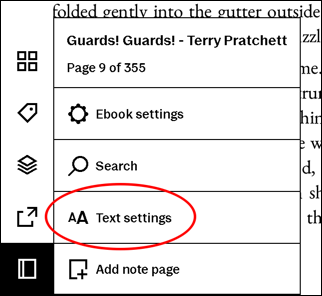
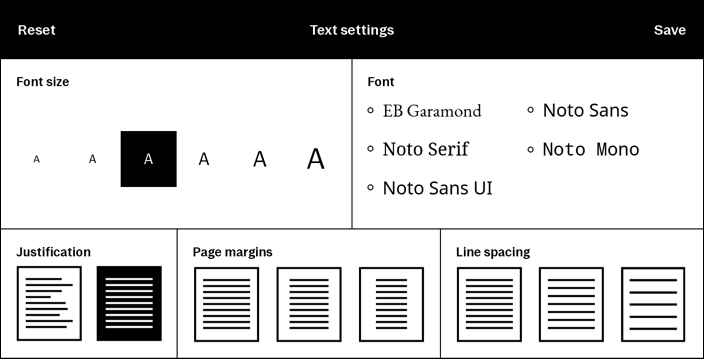
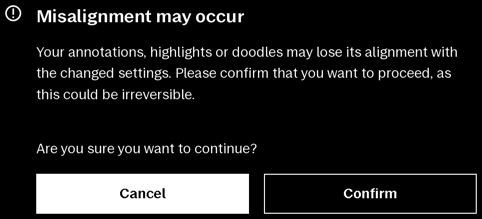
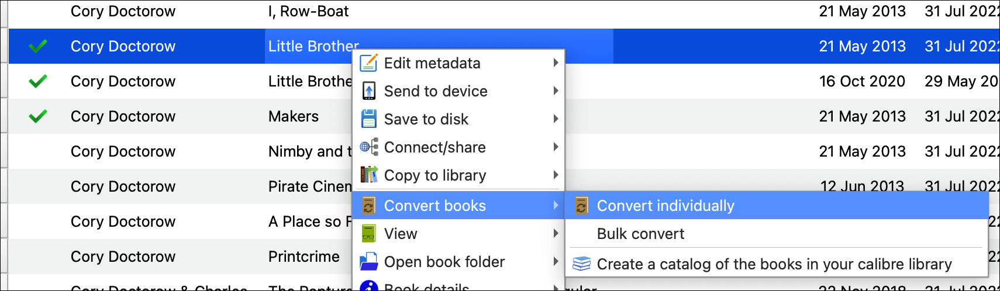
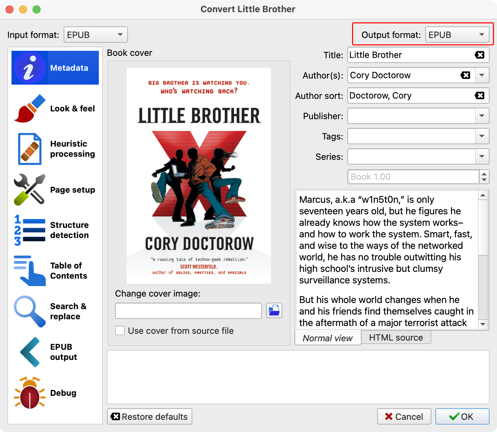
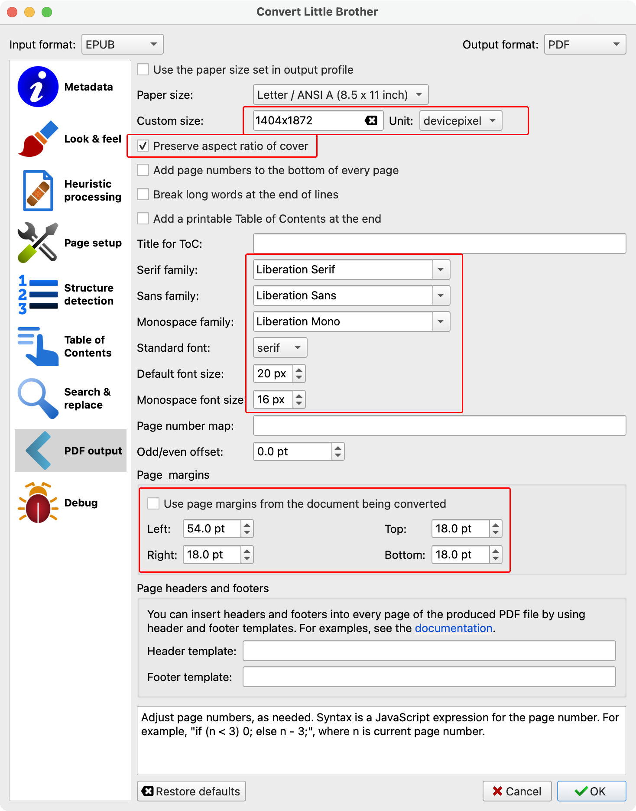
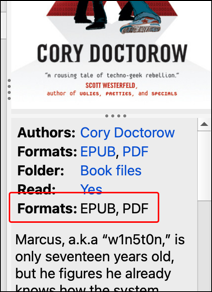
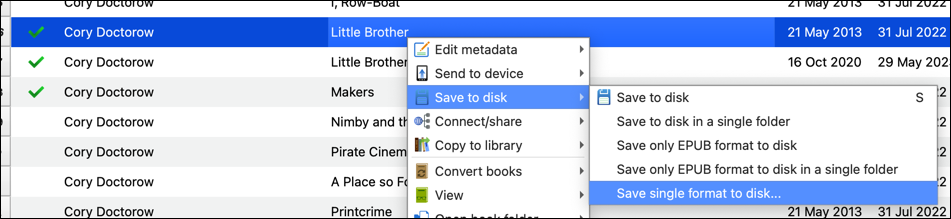
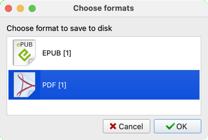

# Calibre

[Calibre](https://calibre-ebook.com/) is a free, open-source program for working with ebook files. This includes ...

* A "library", where you can store and organize your ebook files.

* An ebook reader, where you can read your ebooks on the computer.

* An ebook *editor* for EPUB and AZW3 (Kindle) files. This allows you to edit the HTML and CSS files *within* the EPUB/AZW3 files, and see a live preview of your changes while you're making them.

* A metadata editor, where you can set and change a book's title, author, cover image, descriptions, ISBN numbers, and just about any other kind of metadata the books may have.

* A metadata download tool, which can find cover images, descriptions, ISBN numbers, and other data online, and download them to the ebook file.

* **Converting ebook files between different formats.** For example, if you have a book as an EPUB, Calibre can convert it to PDF.

* Copying ebook files *to*, and in some cases *from*, most "ebook reader" devices.

Calibre also has a plug-in framework which allows third-party developers to add functionality to Calibre. This includes things like support for new ebook readers and support for new file formats.

The [awesome-reMarkable](https://github.com/reHackable/awesome-reMarkable) list has two different Calibre plug-ins for reMarkable tablets.

* [Calibre-Remarkable-Device-Driver-Plugin](https://github.com/naclander/Calibre-Remarkable-Device-Driver-Plugin) works by SSH'ing into the tablet.

    > As of the time I'm writing this (2023-08-03), this plug-in hasn't been updated since April 2022, the Github repo has been "archived", and **the plug-in doesn't work with tablets running firmware 3.x or later.**

* [send_by_rmapi](https://github.com/LisaGlaser/send_by_rmapi) works by using [rmapi](https://github.com/juruen/rmapi) to upload files to the reMarkable cloud, which would then sync the file to your tablet.

## EPUB and PDF files

The reMarkable tablets allow you to upload ebooks in EPUB and PDF formats.

* **PDF files contain pages**. Each page contains instructions like "draw this text in this position" or "draw this picture in this position". In many PDF files, the page contains a single "draw this picture" instruction, and the picture contains all of the text and other content, already laid out as a page-sized BMP, GIF, or JPG file.

* **EPUB files contain text** with formatting instructions. These include things like which words should be **bold** or *italic*, where each paragraph starts and ends, when each chapter starts and ends, and so forth. EPUB file are actually ZIP files containing HTML and CSS files, so when you're reading an EPUB file you're actually looking at a web page.

In cases where the same document is available as both an EPUB and a PDF, it's always better to have the EPUB file, for a couple of reasons:

* If you have an EPUB, you can use Calibre to *create* a PDF. (Or HTML, Markdown, plain text, or another ebook format like MOBI, if you want to read it on an amazon "kindle" device.)

* EPUB files *contain* text, which means they can be processed by assistive reading devices, so that people who are blind or otherwise can't read them, are still able to "consume" them.

**When you upload an EPUB file to a reMarkable tablet, the tablet converts it to PDF internally.** When you "read" the file on the tablet, you are actually reading the PDF file. reMarkable set it up this way because they wanted to allow users to be able to "write" on top of EPUB files, the same way they can with PDF files.

Most ebook readers allow EPUB files to be re-formatted on the fly. This would be a problem for the reMarkable tablet, because they want to allow the user to write "on top of" the file.

* Pen strokes are always stored at the position on the page where they were written.

* Some annotations are made because of where they are *relative to the page*. For example, somebody might write in an empty space at the bottom of a page, because that part of the page happens to be empty.

* Other annotations are made at a position *relative to the text* in the underlying file. For example, if you highlight a sentence or draw a circle around a word, that annotation "belongs with" that part of the text.

Think about what would happen if the text were re-formatted on the fly. For example, if the font was made larger, the lines of text would "shift down" on each page, and the text at the bottom of a page would be moved to the top of the next page. And later in the document, text may end up moving *several pages* away from where it started.

There is no way for the tablet to know *why* each pen stroke was placed where it was, so it won't know which pen strokes need to move with the text, which ones need to move to "a blank space at the bottom of the page containing ___", or which should stay exactly where they are.

This is why, when you re-format an EPUB file on the tablet, it warns you about your pen strokes (or "annotations", as it calls them) possibly not being in the right positions anymore.

### Conversion on the tablet

This conversions done by the tablet, ... have issues. This is true for conversions done when uploading an EPUB file *and* conversions done when re-formatting an existing file.

I had two different books where some of the diagrams were *missing* when I read the file on my tablet. And in one of these files, the text was so large that tables of pre-formatted text ended up being "wrapped" on the page and almost unreadable. Being able to make the text smaller (a *little* bit smaller anyway) would have made that particular table a lot easier to read. (Both of the files where this happened are copyrighted, otherwise I would include them here so you can see for yourself what happened.)

At first I didn't think the tablet *had* a way to change the text formatting, because it's hidden in a sub-menu that otherwise never gets used. However, when I pointed this out [on Reddit](https://www.reddit.com/r/RemarkableTablet/comments/15vi742/comment/jwydeye/), somebody pointed out that they were *looking at the menu* where these settings could be changed, so I went back and searched again. I finally found them, hidden in a sub-menu.

On this panel, you can change the text size, font, turn justification on/off, set margins (small/medium/large), and set line spacing (tight/normal/wide). The list of fonts isn't huge, although I've read that you *can* upload additional fonts under `/usr/share/fonts/`, however I don't see where there would be room for more than one additional font on this panel. (At some point I'll have to try adding more fonts and see if the panel re-sizes to allow more font names on the screen.)

The first time you try to change anything, the tablet will warn you that if you continue, your existing annotations may end up not being in the same locations *relative to the text*.

While you're changing settings, you will not see a "live preview" of what the page will look like. After you save changes, the tablet will generate a new PDF, but it won't *use* the new PDF (i.e. you won't see the new settings on-screen) until you close the file, open a new file, close that, and re-open the first file.

Because of the limited formatting options, I normally convert EPUB files to PDF on a computer, and then upload the PDFs to the tablet.

This allows me to use any fonts that I have on my computer, as well as control the text size, line spacing, and margins a lot more precisely than what the tablet offers. Also, Calibre's EPUB-to-PDF conversion process has never left me with diagrams missing, and I can preview the results of the conversion on the computer's screen before uploading the PDF to the tablet.

## Converting EPUB files to PDF

There are several programs out there which *can* convert EPUB files to PDF. The two I've used are [Pandoc](https://pandoc.org/) and [Calibre](https://calibre-ebook.com/). It's been several years so it's possible things have changed, but from what I remember, I didn't really like the results I got from Pandoc when I tried it. So ever since then I've stuck with Calibre.

### Calibre - Command Line

Calibre comes with a collection of command line tools, which Calibre uses to run the the "jobs" that it performs in the background. Once of these is called `ebook-convert`, which (as the name suggests) converts ebook files from one format to another.

All of the options that you *can* set via the GUI, can also be set using command line options when running the command. [The Calibre documentation](https://manual.calibre-ebook.com/generated/en/ebook-convert.html) explains the command line options available. Note that some options are only available depending on the input and output file types.

Rather than trying to memorize all of the options I normally use, I wrote a script which generates the right command line.

&#x21D2; [The `rm2-make-pdf` script](../scripts/rm2-make-pdf.md)

### Calibre - GUI

If you're more comfortable using the GUI to do it by hand, here's my *attempt* at documenting the options.

> I'm a "command line guy" by nature, I don't normally write documentation about using a GUI like this. If you notice anything I missed or which isn't explained clearly, please let me know so I can update this page.

Start by adding the EPUB (or other ebook) file to Calibre's library. In my case this is easy, because I use Calbre *as* the primary place to store all of my ebooks, and I make it a point to have EPUB versions of every book where that is possible. (The only time it's not is when I've purchased a book which is *only* available as a PDF.)

Right-click on the file you want to convert, "Convert books" &#x2192; "Convert individually".

The "Convert (title)" window will appear. This window has a LOT of settings, accessible in pages using the columns on the left, and some pages have tabs across the top.

The important and/or useful settings are:

* At the top right, Output format: **PDF**

* Look &amp; feel

    * Disable font size rescaling: NO
    * Base font size: 12pt (try this first and preview the resulting PDF, both on the computer screen and then later on the tablet. Adjust up/down as needed, to make things look right to you.)

* Page setup

    * Output profile: **Generic e-ink HD**
    * Input profile: **Default profile**

* PDF output

    * Custom size: `1404x1872` Unit: `devicepixel`
    * Preserve aspect ratio of cover: YES
    * Serif family: (font for text with serifs, such as "Liberation Serif")
    * Sans family: (font for text without serifs, such as "Liberation Sans")
    * Monospace family: (font for mono-spaced text, such as "Liberation Mono")
    * Standard font: which font "family" to use by default (serif/sans/mono)
    * Default font size: 20px
    * Monospace font size: 16px
    * At the bottom, under "Page margins", set the page margins. I normally use `72pt` (1 inch, 25.4mm) for whichever edge the menu appears on (i.e. left edge, if the tablet is set for "right handed"), and `18pt` (&#xBC; inch, 6.35mm) for the others.

    

* Check other pages and make whatever other adjustments you need.

* Click "OK" at the bottom right.

Calibre will start a background job to do the conversion. When it finishes, the information panel (usually on the right, but it can be configured to be on the bottom) will show the original format *and* PDF.

Once the PDF has been created, right-click the file again, and choose "Save to disk" &#x2192; "Save single format to disk..."

Choose PDF as the format, and click "OK".

Save the file where you want it. (I normally choose my "Desktop" folder so I know where to find it.) Calibre creates a directory named after the author, containing a directory named after the book title, which contains the PDF file (and possibly a few other related files, like a copy of the cover art as a JPG file).

Upload the PDF file to your tablet.

### Notes

* [Liberation Fonts](https://github.com/liberationfonts/liberation-fonts/releases) are open-source fonts whose characters are designed to have the exact same metrics (character sizes, spacing, etc.) as "Times New Roman", "Arial", and "Courier New", all of which are copyrighted and cannot legally be distributed in a PDF file. I use them in the PDFs I create, both for legal reasons *and* because I like how they look.

* [Little Brother](https://craphound.com/littlebrother/about/) (the book I used as an example in the screenshots) is copyrighted. The author, [Cory Doctorow](https://craphound.com/bio/), is an even bigger believer in "open source" than I am, and offers free downloads of the ebook versions of many of his books, including "Little Brother".
