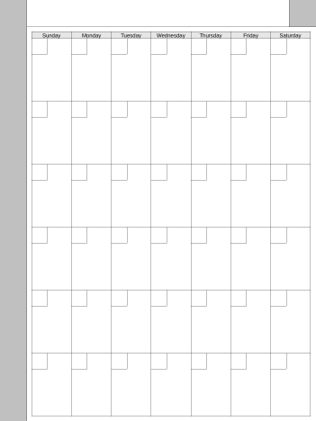
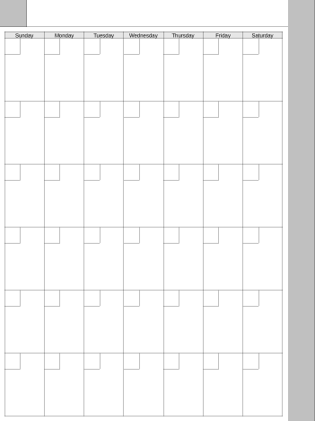

# Calendars - Month

This is just a simple monthly calendar. If you're willing to write in your own title (i.e. "July 2023") and numbers in each date's block, it can be used for *any* month you like.

 

&#x21D2; [Calendar - Right Handed](CalendarMo.png)

&#x21D2; [Calendar - Left Handed](CalendarMo-L.png)

This was the first template where I made both right- and left-handed versions. It was also the first template I made using Perl, with the GD graphics library.

I'm thinking about expanding the script, to have it fill in a month name in the title area and put numbers in the blocks, however it occurs to me that if I do that, it wouldn't really work as a "template" anymore because it would only be useful for that one month.

Anyway.

## License

This script is licensed under the MIT License.

> **The MIT License (MIT)**
>
> Copyright &copy; 2023 John Simpson
>
> Permission is hereby granted, free of charge, to any person obtaining a copy of this software and associated documentation files (the “Software”), to deal in the Software without restriction, including without limitation the rights to use, copy, modify, merge, publish, distribute, sublicense, and/or sell copies of the Software, and to permit persons to whom the Software is furnished to do so, subject to the following conditions:
>
> The above copyright notice and this permission notice shall be included in all copies or substantial portions of the Software.
>
> THE SOFTWARE IS PROVIDED “AS IS”, WITHOUT WARRANTY OF ANY KIND, EXPRESS OR IMPLIED, INCLUDING BUT NOT LIMITED TO THE WARRANTIES OF MERCHANTABILITY, FITNESS FOR A PARTICULAR PURPOSE AND NONINFRINGEMENT. IN NO EVENT SHALL THE AUTHORS OR COPYRIGHT HOLDERS BE LIABLE FOR ANY CLAIM, DAMAGES OR OTHER LIABILITY, WHETHER IN AN ACTION OF CONTRACT, TORT OR OTHERWISE, ARISING FROM, OUT OF OR IN CONNECTION WITH THE SOFTWARE OR THE USE OR OTHER DEALINGS IN THE SOFTWARE.

## The Script

```perl
#!/usr/bin/env perl -w
#
# make-calendar-p
# John Simpson <jms1@jms1.net> 2023-07-04
#
###############################################################################
#
# The MIT License (MIT)
#
# Copyright (C) 2023 John Simpson
#
# Permission is hereby granted, free of charge, to any person obtaining a
# copy of this software and associated documentation files (the “Software”),
# to deal in the Software without restriction, including without limitation
# the rights to use, copy, modify, merge, publish, distribute, sublicense,
# and/or sell copies of the Software, and to permit persons to whom the
# Software is furnished to do so, subject to the following conditions:
#
# The above copyright notice and this permission notice shall be included in
# all copies or substantial portions of the Software.
#
# THE SOFTWARE IS PROVIDED “AS IS”, WITHOUT WARRANTY OF ANY KIND, EXPRESS OR
# IMPLIED, INCLUDING BUT NOT LIMITED TO THE WARRANTIES OF MERCHANTABILITY,
# FITNESS FOR A PARTICULAR PURPOSE AND NONINFRINGEMENT. IN NO EVENT SHALL
# THE AUTHORS OR COPYRIGHT HOLDERS BE LIABLE FOR ANY CLAIM, DAMAGES OR OTHER
# LIABILITY, WHETHER IN AN ACTION OF CONTRACT, TORT OR OTHERWISE, ARISING
# FROM, OUT OF OR IN CONNECTION WITH THE SOFTWARE OR THE USE OR OTHER
# DEALINGS IN THE SOFTWARE.
#
###############################################################################

require 5.005 ;
use strict ;

use GD ;                        # cpan install GD
use GD::Text::Align ;           # cpan install GD::Text

my $page_w      = 1404 ;        # page width
my $page_h      = 1872 ;        # page height
my $menu_w      = 120 ;         # width of menu and close button areas
my $title_h     = 120 ;         # height of title area

my $padding     = 20 ;          # blank space around calendar
my $dow_h       = 30 ;          # height of "day of week" labels

my $font_file   = "$ENV{'HOME'}/Library/Fonts/LiberationSans-Regular.ttf" ;
my $font_size   = 18 ;

my @dow = qw( Sunday Monday Tuesday Wednesday Thursday Friday Saturday ) ;

###############################################################################
#
# Center a string around a point

sub center_text($$$$$)
{
    my $img     = shift ;
    my $tx      = shift ;
    my $ty      = shift ;
    my $text    = shift ;
    my $colour  = shift ;

    ########################################
    # Calculate real position for text

    my $a = GD::Text::Align->new( $img ,
        'valign' => 'center' ,
        'halign' => 'center' ,
    ) ;
    $a->set_font( $font_file , $font_size ) ;
    $a->set_text( $text ) ;

    my @b = $a->bounding_box( $tx , $ty , 0 ) ;

    ########################################
    # DEBUG - print the position
    # - needed this to figure out the correct font size
    #
    # printf "(%4d,%4d) ... (%4d,%4d) (%4d,%4d) (%4d,%4d) (%4d,%4d) %s\n" ,
    #     $tx , $ty , @b[0..7] , $text ;

    ########################################
    # Add the text to the image
    # - (x,y) should be lower left corner

    $img->stringFT( $colour , $font_file , $font_size , 0 , $b[0] , $b[1] , $text ) ;
}

###############################################################################
#
# Create one calendar image

sub calendar_basic($$)
{
    my $left_handed = shift ;
    my $out_file    = shift ;

    ########################################
    # Adjust positions for left/right handedness

    my $dal = $menu_w ;             # drawing area, left x
    my $dar = $page_w - 1 ;         # drawing area, right x
    my $mal = 0 ;                   # menu area, left x
    my $mar = $menu_w - 1 ;         # menu area, right x
    my $msx = $mar ;                # menu separator, x
    my $cal = $page_w - $menu_w ;   # close button area, left x
    my $car = $page_w - 1 ;         # close button area, right x
    my $csx = $cal ;                # close button separator, x

    if ( $left_handed )
    {
        ########################################
        # menu is on right, content area is on left

        $dal = 0 ;                      # drawing area, left x
        $dar = $page_w - $menu_w - 1 ;  # drawing area, right x
        $mal = $page_w - $menu_w ;      # menu area, left x
        $mar = $page_w - 1 ;            # menu area, right x
        $msx = $mal ;                   # menu separator, x
        $cal = 0 ;                      # close button area, left x
        $car = $menu_w - 1 ;            # close button area, right x
        $csx = $car ;                   # close button separator, x
    }

    ###############################################################################
    #
    # Create canvas

    my $img = new GD::Image( $page_w , $page_h ) ;

    ########################################
    # Allocate colours

    my $white   = $img->colorAllocate( 255 , 255 , 255 ) ;
    my $grey75  = $img->colorAllocate( 192 , 192 , 192 ) ;
    my $grey90  = $img->colorAllocate( 230 , 230 , 230 ) ;
    my $black   = $img->colorAllocate(   0 ,   0 ,   0 ) ;

    ###############################################################################
    #
    # Menu/title zones

    $img->setThickness( 1 ) ;

    $img->filledRectangle( $mal , 0 , $mar , $page_h-1 , $grey75 ) ;
    $img->filledRectangle( $cal , 0 , $car , $title_h-1 , $grey75 ) ;

    $img->line( $mar , 0 , $mar , $page_h-1 , $black ) ;
    $img->line( $dal , $title_h-1 , $dar , $title_h-1 , $black ) ;
    $img->line( $csx , 0 , $csx , $title_h-1 , $black ) ;

    ###############################################################################
    #
    # Draw boxes for the days

    ########################################
    # Calculate box size

    my $box_w = int( ( $page_w - $menu_w  - 2 * $padding          ) / 7 ) ;
    my $box_h = int( ( $page_h - $title_h - 2 * $padding - $dow_h ) / 6 ) ;

    ########################################
    # Draw boxes for each date

    $img->setThickness( 1 ) ;

    for my $r ( 0 .. 5 )
    {
        for my $c ( 0 .. 6 )
        {
            my $ax = $dal + $padding + ( $c * $box_w ) ;
            my $ay = $title_h + $padding + ( $r * $box_h ) + $dow_h ;
            my $bx = $ax + $box_w ;
            my $by = $ay + $box_h ;
            my $dx = $ax + int( ( $bx - $ax ) * 0.4  ) ;    # 40% of box width
            my $dy = $ay + int( ( $by - $ay ) * 0.25 ) ;    # 25% of box height

            $img->rectangle( $ax , $ay , $bx , $by , $black ) ;
            $img->rectangle( $ax , $ay , $dx , $dy , $black ) ;
        }
    }

    ###############################################################################
    #
    # Add day-of-week labels

    for my $c ( 0 .. 6 )
    {
        ########################################
        # Box around day of week

        my $ax = $dal + $padding + ( $c * $box_w ) ;
        my $ay = $title_h + $padding ;
        my $bx = $ax + $box_w ;
        my $by = $ay + $dow_h ;

        $img->filledRectangle( $ax , $ay , $bx , $by , $grey90 ) ;
        $img->rectangle( $ax , $ay , $bx , $by , $black ) ;

        ########################################
        # Draw DOW text

        my $tx = $dal + $padding + ( $c * $box_w ) + ( $box_w / 2 ) ;
        my $ty = $title_h + $padding + ( $dow_h / 2 ) ;

        center_text( $img , $tx , $ty , $dow[$c] , $black ) ;
    }

    ########################################
    # Write the output file

    open( O , '>' , $out_file )
        or die "ERROR: can't create \"$out_file\": $!\n" ;
    binmode O ;
    print O $img->png() ;
    close O ;
}

###############################################################################
###############################################################################
###############################################################################

calendar_basic( 0 , 'CalendarMo.png' ) ;
calendar_basic( 1 , 'CalendarMo-L.png' ) ;
```
